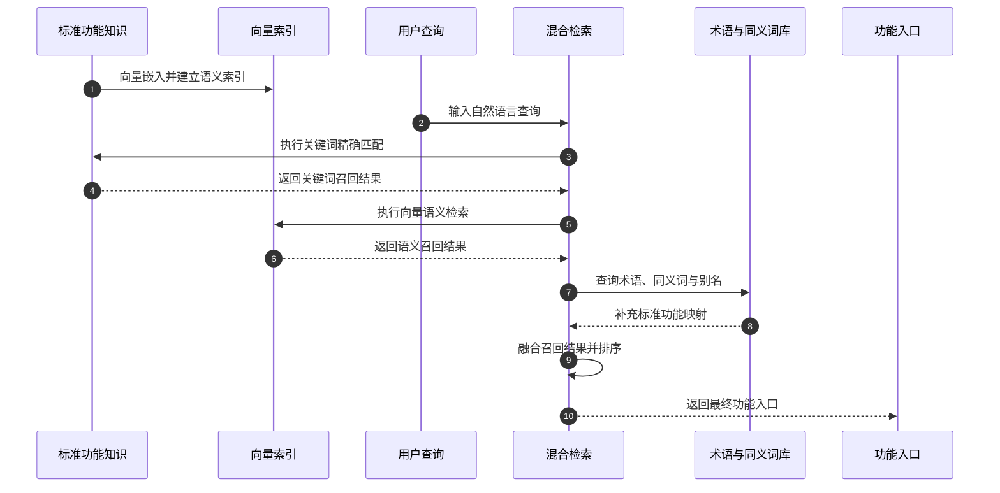
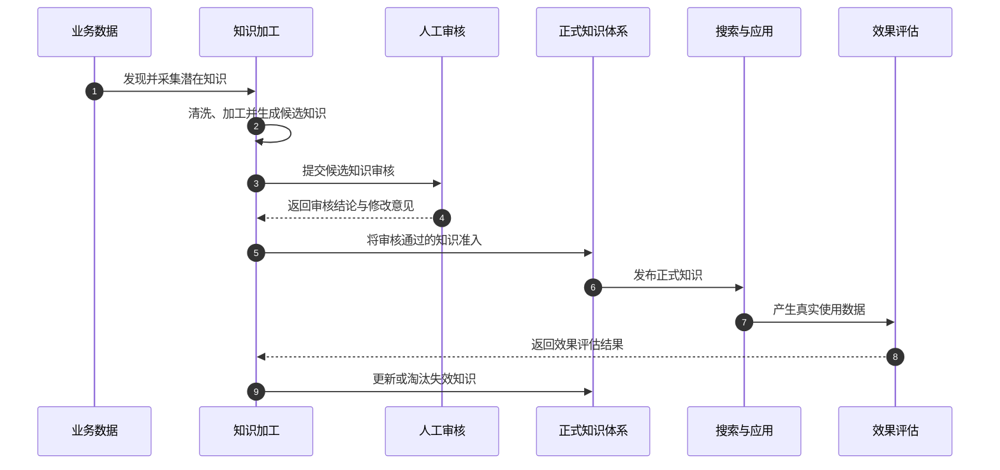
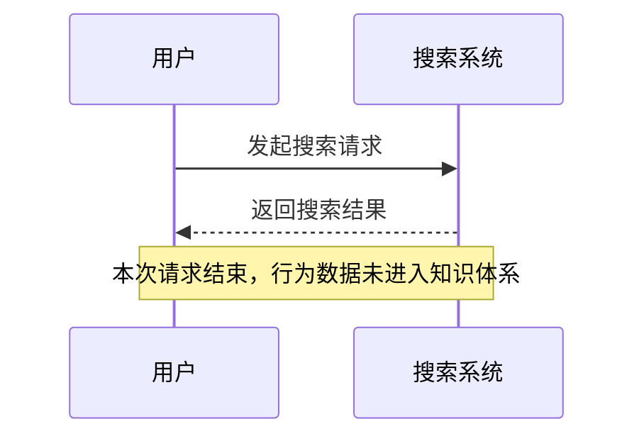
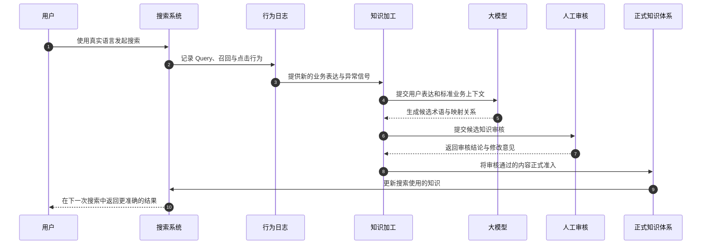
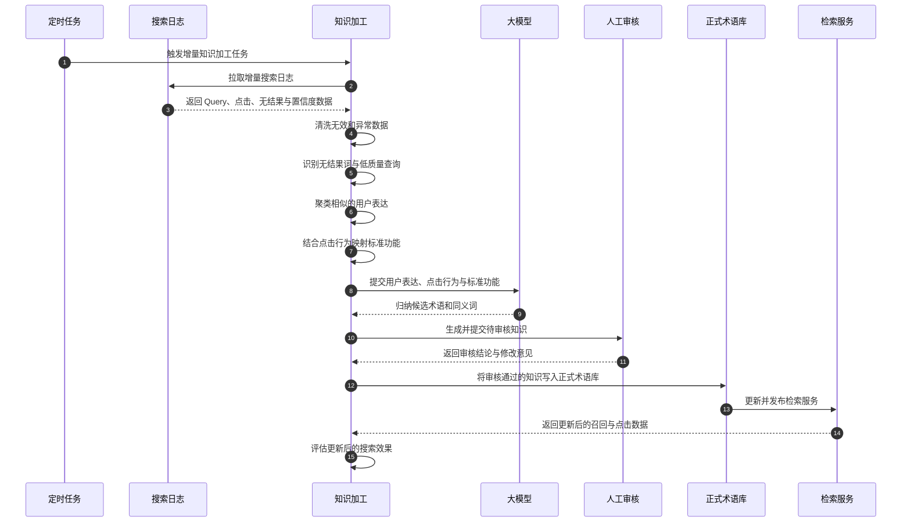
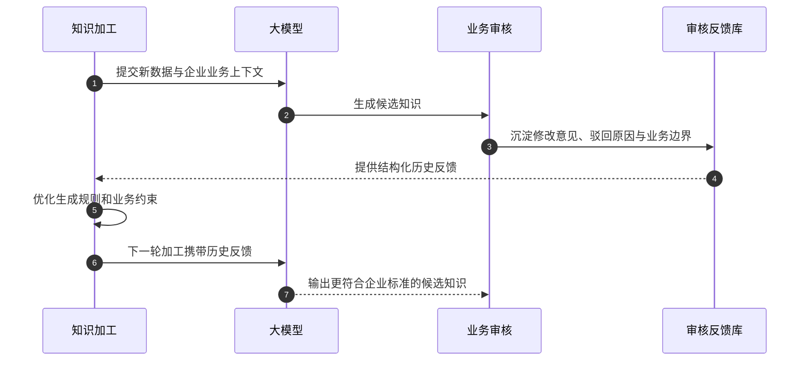
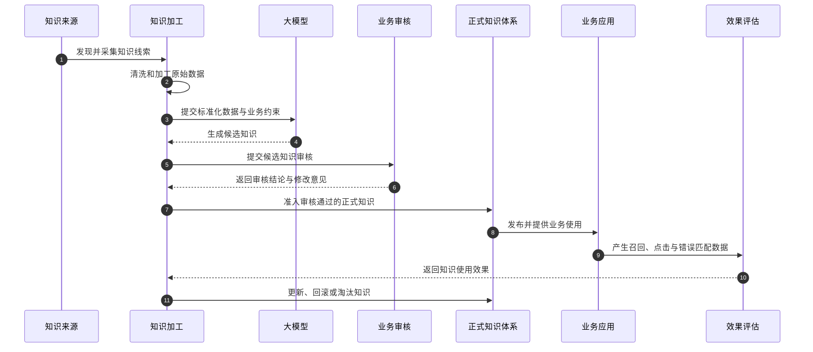
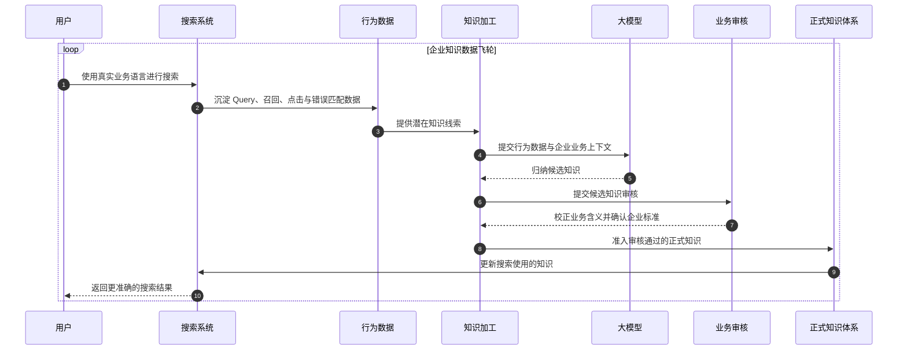

**从某项目的功能搜索实践，看知识工程如何驱动数据飞轮与知识持续演进。**

**企业搜索真正困难的，从来不只是找到几个相似的字符串，或者简单的关键词/向量混合搜索，而是理解用户正在用自己的语言描述企业的哪一项业务，真正的理解企业的业务**。

对于企业知识库来说，知识只有被使用，才能真正产生价值。用户在搜索框中主动查询是一种使用，RAG 在生成答案前召回知识是一种使用，Agent 通过 Search Tool 查找业务信息，同样也是一种使用。应用形态虽然不同，但它们最终都依赖搜索完成知识的连接：企业知识能否被稳定检索、准确理解和可靠返回，直接决定了上层应用能否稳定运行。知识底座不稳定，再强的模型、再复杂的 Agent 编排，也很难长期服务真实业务。

与此同时，每一次 Query、点击、无结果、错误命中和反复改写，也都留下了企业知识被真实使用的痕迹。**这些痕迹不仅告诉我们用户在寻找什么，还会暴露术语差异、知识缺口、模糊的业务边界和已经失效的内容**。沿着这些反馈往回看，我们才能知道搜索为什么不准确、Agent 为什么不稳定，以及知识底座究竟需要在哪里补充和修正。

所以，**搜索是企业知识最大的出口，也是最值得深入挖掘的入口**。它一头连接用户、RAG 与 Agent 对知识的使用，另一头连接企业知识的生产与治理。**当真实使用中暴露的问题能够被持续发现和修正，搜索就不再只是返回一次结果，而会成为推动企业知识持续演进的起点，并为上层应用提供越来越稳定、可信的知识底座**。

## 一、一个看似简单的 APP 搜索需求

最近，我们在某项目中讨论一个 APP 功能搜索场景。

项目涉及的 APP 中有大量面向用户的业务功能，例如账户查询、转账汇款、信用卡还款、账单查询、生活缴费、贷款服务和网点服务等。随着功能越来越多，用户很难再通过逐级菜单快速找到需要的入口，因此需要在 APP 顶部增加一个统一搜索框。

从产品表面来看，这似乎只是一个普通的功能搜索需求：用户输入一个关键词，系统返回与之匹配的功能入口。

但真正进入实际场景后，会发现事情远没有这么简单。

企业定义的标准功能名称可能是：

> 信用卡还款

但用户输入的内容可能是：

> 还信用卡  
> 还卡  
> 卡还款  
> 信用卡缴费  
> 我要还钱  
> 信用卡账单怎么还  
> 卡片还款在哪里

用户不会按照产品经理定义的标准名称进行搜索，也不会关心某项功能在系统中使用了什么规范术语。他们只会按照自己的理解、习惯和当前需求来表达。

因此，这个需求真正需要解决的，并不是简单的文字匹配，而是如何把用户不规范、口语化、碎片化的表达，准确映射到企业内部的标准业务功能。

接收到这个需求后，从技术实现上看，我脑子里很容易想到一套成熟且有效的解决方案。

首先，将 APP 中的功能名称、功能描述、业务分类和跳转入口整理成标准知识，并通过 RAG 的向量嵌入技术建立语义索引。这样，即使用户输入的内容与标准功能名称并不完全一致，系统也可以通过语义相似度召回相关功能。

其次，在检索阶段同时使用关键词匹配与向量检索。关键词检索负责标准名称、业务术语和核心词的精确命中；向量检索负责理解口语化、长句式和表达不同但含义相近的查询；再通过混合检索与排序策略融合两路结果，兼顾精确性与语义召回能力。

最后，补充术语库、同义词库和别名库，把“还卡”“查流水”“办卡”这类高频用户表达，明确映射到企业内部的标准功能。对于已经识别出来的表达差异，这种方式简单、直接，而且效果稳定。



这套体系并没有太大的问题。它是现阶段非常成熟的企业RAG搜索技术方案，也足以解决当前项目中的大部分搜索需求。无论是用户直接搜索、RAG 应用召回知识，还是 Agent 通过 Search Tool 查询业务信息，都可以复用这套检索能力。

但它也有一个容易被忽略的边界：**搜索系统能够检索已经进入知识库的内容，同义词库能够覆盖已经被发现和配置的表达，向量模型可以扩大语义召回范围，却无法天然掌握企业内部不断变化的业务定义与服务边界**。

换句话说，这套方案能够很好地解决了**今天已经知道的问题**，却很难自动发现**明天用户还会怎样表达**。**如果新的用户语言、业务变化和错误匹配只能依靠人工发现，再由人工逐条补充术语，维护知识，那么检索能力依然建立在一套相对固定的知识之上**。

当问题走到这里，我们需要继续追问的，就不再只是如何配置更多同义词、叠加更多检索策略，而是系统能否从持续变化的用户表达中，准确识别它所对应的企业产品、业务功能和服务边界。**讨论的重点也由此从“如何把结果搜索出来”，转向了“系统是否真正理解企业业务”。**

## 二、企业搜索真正的困难点在于理解企业业务

在搜索RAG技术体系中，我们经常讨论**关键词(BM25)检索、向量检索、混合检索、RRF 排序、查询重写和语义召回**。这些技术都很重要,是当前所有AI知识库产品的标准技术栈。

但是在企业场景中，检索质量不佳，并不一定是搜索引擎不够强，也不一定是向量模型不够准确。很多时候，真正的问题是：

> **用户使用的是自己的语言，而系统保存的是企业的语言和标准知识。**

用户说“查流水”，业务系统中对应的功能可能是“交易明细查询”。

用户说“卡被冻结了”，实际可能对应卡片临时挂失、账户冻结查询，或者风险控制相关服务。

用户说“还卡”，系统需要理解他所说的“卡”是信用卡，而不是借记卡、社保卡或其他业务对象。

这种差异并不是简单的同义词关系。它背后包含了企业的业务定义、产品结构、专业术语和服务边界。

因此，**术语库和同义词库从本质上解决的，不是两个字符串之间的替换问题，而是用户语言与企业业务语言之间的语义对齐问题。**

企业搜索需要具备的能力，也不只是理解一句话在自然语言中的意思，而是进一步理解：

> **这句话放在当前企业的业务体系中，究竟对应哪个产品、哪个功能和哪项服务？**

**AI知识库产品只有建立这种企业理解能力，搜索系统才能从一个文字匹配工具，进一步变成连接用户需求与企业业务的入口。**

## 三、同义词库不应该是一张人工配置表

在上面我们聊到RAG知识库产品的标准配置，同义词/术语库的功能，能够天然解决企业里面用户和系统之间的语义鸿沟，因此，很多传统/AI知识库系统通常会提供术语库、同义词库和别名库等功能，管理员可以配置：

```text
还卡 → 信用卡还款
查流水 → 交易明细查询
办卡 → 信用卡申请
```

这种方式在数据量较小、业务变化较少时，可以解决一部分问题。但一旦进入真实的企业场景，单纯依赖人工维护就会遇到明显的瓶颈。

**首先，用户表达无法被穷举，工作量巨大且不可持续**

同一个业务，不同地区、不同年龄、不同职业背景的用户，可能会使用完全不同的表达方式。即使业务人员已经整理了几十个同义词，也很难覆盖真实用户不断变化的语言习惯。

**其次，人工维护通常是滞后的。**

只有当业务人员发现某个词搜索不到，或者收到用户反馈之后，才会补充同义词。整个过程依赖人工发现、人工分析和人工录入，始终处于被动补漏状态。

**再次，大量真实的用户搜索数据没有被真正利用。**

企业每天产生大量搜索日志、点击日志、无结果日志和低置信度召回记录。这些数据记录了用户如何理解企业业务，但在传统系统中，它们往往只作为日志被保存，并没有进入企业知识体系。

所以，我认为术语库和同义词库不应该只是后台的一张配置表，而应该被重新定义为一类**企业知识资产**。

既然是知识资产，就不应该只依赖人工录入，而应该具备完整的知识生产和治理过程：



这意味着，同义词库不再是一个孤立功能，而应该被纳入企业知识工程体系之中。

## 四、用户的输入，本身就是企业知识的原材料

用户在搜索框中输入一个 Query 时，系统通常只把它当成一次待处理的请求。但从知识运营的角度看，这个输入还记录了用户如何理解和描述企业业务。产品经理定义的是“信用卡还款”，用户想到的却可能是“还卡”；系统保存的是“交易明细查询”，用户习惯说的则是“查流水”。这些表达差异不会出现在标准功能清单里，只会在一次次真实搜索中暴露出来。

当然，单独一条 Query 还不能直接成为知识。“还卡”可能指向信用卡还款，也可能只是一个缺少上下文的模糊表达。只有把搜索词与当时返回的结果、召回分数、用户最终点击的功能以及是否继续改写查询放在一起，我们才能逐渐看清它背后的真实意图。如果许多用户搜索“还卡”后都进入“信用卡还款”，这个行为就为术语映射提供了证据；如果用户连续输入“账单”“查消费”“信用卡明细”才找到目标功能，则说明现有知识可能没有覆盖用户习惯使用的表达。

无结果查询只是其中一种信号。有些查询虽然返回了结果，但用户没有点击；有些词长期只能以很低的置信度召回；还有一些表达经常命中错误功能，或者在短时间内突然增长。把这些信号关联起来以后，搜索日志才不再是一堆孤立的字符串，而会变成一组能够解释“用户在找什么、系统哪里没有理解”的业务线索。

传统搜索链路通常是：



在这条链路里，系统完成了本次响应，搜索行为也随之沉入日志。即使相同问题反复出现，通常也要等到用户投诉或运营人员主动排查时，才有人回头补充同义词。我们希望改变的并不是前台搜索的交互方式，而是让请求结束之后产生的数据继续流动：



这样，一次搜索仍然只解决用户当下的问题，但大量搜索行为会在后台形成新的知识线索。系统通过这些线索发现未知表达，再经过加工和审核回到正式知识体系。企业不必等到问题被集中反馈后再被动补漏，而可以从真实使用中持续观察用户如何描述自己的业务。

## 五、为什么必须把知识加工引入搜索召回体系


发现日志中的异常信号以后，最直接的做法是把搜索词批量交给大模型，让它生成一份同义词列表。这种方式可以很快完成一次演示，但真正运行起来会遇到许多具体问题：本次应该处理哪个时间范围的数据，重复和无效查询如何过滤，什么样的点击行为足以支撑一条映射，模型生成的内容采用什么格式，以及处理失败后从哪里恢复。只靠一次 Prompt，这些问题都没有稳定答案。

因此，我们会把这项工作放进知识加工任务中。任务按照固定周期和增量水位拉取搜索日志，先清理无效、重复和异常数据，再识别无结果、低置信度和多次改写的查询。对于保留下来的数据，流程会结合用户最终点击的功能进行分组，并把含义相近的表达聚在一起。这样，提交给大模型的就不再是没有上下文的词表，而是一组带有出现频次、点击去向和标准功能信息的业务样本。

加工的工作流示例如下图：


大模型完成归纳后，流程也不会直接写入术语库。每条候选知识还需要带上原始表达、建议映射、支撑数据、置信度和可能存在的歧义，形成结构化的待审核内容。业务人员完成审核后，只有通过准入的术语才会发布到检索服务；发布之后产生的新召回和点击数据，又会在后续任务中被用来评估本次更新是否有效。

以当前 APP 搜索场景为例，整条链路是这样运行的：



这条流水线的价值首先体现在可重复运行。数据范围、过滤条件、候选生成标准和失败恢复方式都被固化在任务中，同一套规则可以稳定处理每天或每周产生的新数据。随着项目推进，企业对还款、缴费、转账、冻结和挂失等概念的专业定义，也可以逐步补充到加工上下文中，而不是依赖某个业务人员每次临时向模型解释。

与此同时，候选知识的格式、证据要求、适用范围和审核条件也会成为流程的一部分。哪些内容允许自动进入待审核区，哪些歧义必须标记出来，哪些业务必须由特定人员确认，都可以在任务中明确约束。知识加工因此不只是把多个模型节点串在一起，而是把企业的处理流程、专业知识和治理规范固化成一条能够长期运行的知识生产线。大模型只有进入这样的工作流，才可能稳定地参与企业知识生产。

## 六、人工审核，是知识准入的治理屏障


知识加工任务生成候选术语后，业务人员看到的应该不只是一组“原词 → 标准词”的映射。为了作出判断，审核页面还需要呈现这条候选知识来自哪些搜索、出现了多少次、用户点击过哪些功能、模型为什么给出当前建议，以及是否存在多个可能的业务去向。证据和候选结果放在一起，审核人员才能判断它究竟是一条稳定的用户表达，还是数据量不足造成的偶然关联。

例如，“信用卡缴费”可能被模型映射到“信用卡还款”，也可能因为“缴费”这个词命中生活缴费；“卡被冻结”可能对应临时挂失、账户冻结查询或风险控制服务。单纯比较文本相似度，很难确定唯一答案。业务人员需要结合标准功能定义、用户点击分布和适用上下文，决定这条候选词可以直接通过、需要修改映射、只能在特定条件下使用，还是应该暂时驳回。

审核过程中还经常会遇到已有术语重复、标准名称不规范或适用范围过大的情况。此时，业务人员不仅是在判断模型生成得对不对，也是在维护企业内部统一的业务语言。对于证据充分、含义明确的候选知识，可以确认准入；对于存在歧义的内容，可以补充上下文限制；对于无法确认或可能误导用户的映射，则保留原因并退回流程，而不是让它直接影响线上搜索。

这就是人工审核在 AIS 知识引擎中的作用。**大模型负责从大量数据中缩小范围、归纳表达和提供建议,让模型充分发挥效率工具的能力**，业务人员则依据企业规则作出最终判断。让人承担正式知识的准入责任，并不是否定模型能力，而是让模型能够进入真实业务的必要条件。在企业知识体系中，生成只是候选，写入也只是技术动作；只有带着证据经过审核和责任确认的内容，才应该成为正式知识。至于审核过程中产生的修改意见和驳回原因如何继续发挥价值，则是下一章要讨论的问题。

## 七、审核不是结束，而是下一轮学习的开始

在实际的知识加工流程中，一批候选术语提交给业务人员审核，并不意味着这次任务已经结束。恰恰相反，审核环节往往是系统第一次真正接触企业业务规则的地方。如果流程只记录“通过”或“驳回”两个状态，那么业务人员在审核过程中作出的判断，仍然会停留在审批记录里，下一次任务运行时，大模型还会在相同的地方犯错。

例如，某次知识加工任务根据搜索日志和点击行为，生成了这样一组候选映射：

```text
信用卡缴费 → 信用卡还款
```

从统计信号来看，这个映射可能是合理的：一部分用户搜索“信用卡缴费”后，确实进入了“信用卡还款”功能。但业务人员看到这条候选知识时，还会进一步考虑它在整个业务体系中的含义。“缴费”本身也是一个独立的业务概念，如果不带任何上下文就直接建立映射，可能会让生活缴费相关查询错误地命中信用卡还款。因此，审核人员没有简单地点击驳回，而是补充了一条具体的业务意见：

> 该词存在业务歧义，只能结合“信用卡”“卡片”等上下文使用。

在我们的设计中，这类意见不会只作为一段备注保存。知识加工流程会同时记录候选词、原始映射、审核动作、修改后的映射、驳回原因、适用范围和业务边界等信息。下一轮定时任务启动后，系统会根据当前处理的功能和业务分类，读取相关的历史审核记录，并把它们与新的搜索数据一起提供给大模型。这样，大模型看到的不再只是一批孤立的 Query，还能看到企业曾经如何判断类似问题。

最初几轮运行时，业务人员可能需要频繁修改候选内容。随着审核反馈逐渐积累，流程会开始识别哪些词可以直接作为同义词，哪些词必须结合上下文，哪些业务边界不能由模型自行判断。**这里发生变化的并不是底层大模型本身，而是模型每次运行时能够获得的企业上下文、历史反馈和生成约束越来越完整**。**最终，真正“学会”企业规则的，是运行在 AIS 中的整条知识加工工作流**。

这个过程形成了一个可以反复运行的反馈闭环：



从这个角度看，审核不是知识生产的终点，而是下一轮加工的输入。用户搜索行为让系统看到用户如何表达需求，业务审核意见则告诉系统企业如何解释和约束这些表达。只有这两类反馈同时进入流程，系统才有可能在后续运行中既理解用户，又不越过企业真实的业务边界。

## 八、从术语入库到知识全生命周期治理

候选术语通过审核并写入正式术语库，只代表它完成了知识准入，并不代表后续工作已经结束。如果只在数据库中保存“信用卡缴费是信用卡还款的同义词”这一条关系，那么一段时间以后，我们很难再回答几个关键问题：当初为什么建立这个映射，它来自哪些真实搜索，谁确认了它的业务含义，以及上线之后究竟有没有改善搜索效果。

因此，在设计这条链路时，我们不能只保存最终结果，还需要把知识产生过程中的证据一起保留下来。仍然以“信用卡缴费”为例，系统在生成候选知识时，会关联支撑这条判断的搜索记录、出现频次、用户最终点击的功能以及当时的召回结果；进入知识加工后，还会留下任务编号、模型版本和使用的业务规则；业务人员审核时所作的修改、给出的原因和最终结论，也会成为这条知识的一部分。

当术语正式发布到检索服务后，我们还要继续观察它在真实搜索中的表现。例如，相同 Query 的无结果率是否下降，目标功能的点击率是否提升，用户是否还会继续修改搜索词，以及这条新映射有没有带来其他错误命中。如果效果不符合预期，系统需要能够找到对应的知识版本，重新进入审核流程，必要时回滚、停用或调整适用范围。

沿着这条路径，一条术语会经历从发现、加工到使用和更新的完整生命周期：



这条链路把原本分散在搜索日志、知识加工任务、模型调用、审核记录和发布记录中的信息串在了一起。运营人员可以从正式术语回溯到它的来源，也可以从一次错误搜索定位到是哪条知识、哪次审核和哪个版本产生了影响。业务规则发生变化时，我们不需要重新清理整张同义词表，而是可以找到受影响的知识范围，有针对性地重新加工和发布。

这也是知识治理与普通数据写入之间最直接的区别。数据被保存下来，只说明系统记录了一个结果；只有当它的来源、加工过程、审核责任和使用效果都能够被追踪，并且可以根据业务反馈继续更新时，它才真正具备企业知识资产应有的可管理、可审计和可演进能力。

## 九、数据飞轮转动的，是企业理解能力


当搜索行为、知识加工、人工审核和效果评估真正连接起来后，数据飞轮才不再是一个抽象概念。它并不是把更多日志堆进数据库，也不是让大模型反复生成更多同义词，而是让每一轮真实使用都能为下一轮知识改进提供依据。

在第一轮运行时，知识加工任务可以从增量日志中找出高频无结果词、低置信度查询和需要多次改写的搜索。系统再结合用户最终点击的功能，对相似表达进行聚类，并交给大模型生成候选术语。业务人员审核后，其中一部分候选知识会进入正式术语库，另一部分则会因为歧义、业务边界或证据不足被修改和驳回。

知识发布之后，第二轮运行处理的就不再是完全相同的数据。新的术语已经参与搜索，系统可以比较更新前后的召回结果、点击行为和错误命中情况。有效的知识会得到更多真实使用数据的验证，不准确的映射则会更快暴露出来；与此同时，上一轮的审核意见也会约束新的候选知识生成。这些变化继续进入下一次知识加工，飞轮才真正转动起来。

在当前这个搜索场景中，这个循环可以表示为：



经过几轮运行以后，最直观的变化可能是无结果查询减少、目标功能点击率提高，但更有价值的变化发生在流程内部。大模型生成的候选内容开始更符合企业的术语规范，业务人员不再反复纠正相同类型的问题，原本只存在于个人经验中的业务边界也逐渐变成可以被流程读取和执行的规则。术语数量可能仍在增长，但审核成本和错误率不应该跟着线性增长。

因此，数据飞轮最终积累的并不只是更多数据，而是企业对用户表达、业务规则和知识边界越来越深入的理解。在这个过程中，大模型负责从大量行为数据中发现规律并生成候选内容，业务人员负责判断真实业务含义并承担最终准入责任，知识工程则把数据、模型和人的经验组织成一条可以反复运行的生产线。三者不是相互独立的功能模块，而是在每一轮运行中彼此提供输入、校正和反馈，最终让企业知识能够在真实业务中持续生长。

## 十、**企业AI知识库下一站：让知识自己长出来**

回到最初的需求，它只是某项目中位于 APP 顶部的一个功能搜索框。第一阶段使用成熟的 RAG 检索体系，把功能名称、功能描述、业务入口和相关术语写入 AIS 知识库，再结合关键词检索、向量检索和同义词匹配，已经能够解决大部分已知的搜索问题。

如果需求停留在这里，这会是一个功能完整、效果可用的搜索入口。但系统上线运行后，用户会不断带来知识库中没有的新表达。有人搜索“还卡”，有人连续修改几次 Query 才找到“信用卡账单查询”，还有些用户看到结果后没有点击。这些行为被记录下来后，知识加工任务可以从中识别新的业务语言，结合点击去向和标准功能生成候选映射，再交给业务人员审核。通过准入的知识重新发布到检索服务，审核时形成的修改意见则进入下一轮任务，约束模型不要重复犯同样的错误。

沿着这条链路再看，搜索框的作用已经发生了变化。它一方面继续为用户提供功能入口，另一方面也让企业看见用户如何理解自己的产品和服务。前台每一次真实使用都有可能暴露一个术语缺口或业务边界问题，后台则通过知识加工、人工审核和效果评估把这些问题变成可以管理的正式知识。知识不再只依赖项目初期的一次性整理，而是在持续使用中得到补充和修正。

这也是 AIS 知识引擎在这个场景中希望发挥的价值。保存文档、切分内容和提供 RAG 检索只是知识被使用的基础；更重要的是，**把知识的发现、加工、审核、准入、发布和评估连接起来，并且保留每一次变化的来源、责任和效果**。搜索提供了最真实的数据入口，**知识加工推动数据向知识流动，人工审核守住正式知识的质量边界，持续反馈则让整套体系能够随着业务一起变化**。

因此，**企业AI知识库下一站，需要结合知识工程的能力，建立一套让企业知识能够从真实业务中持续生长的机制**。知识工程的价值，也不只是让模型生成更多内容，而是让这种生长变得稳定、可控、可审核和可追踪，并最终沉淀为真正属于企业自己的 AI 能力。
