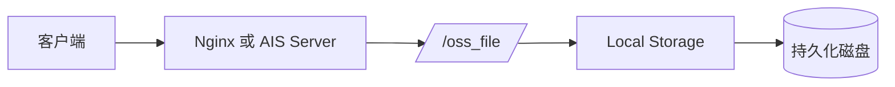
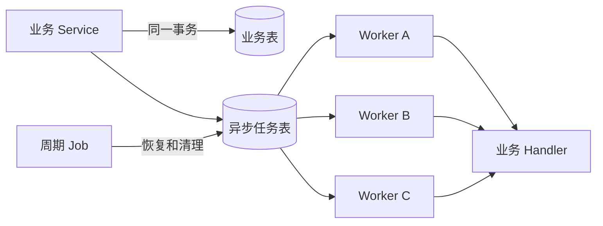
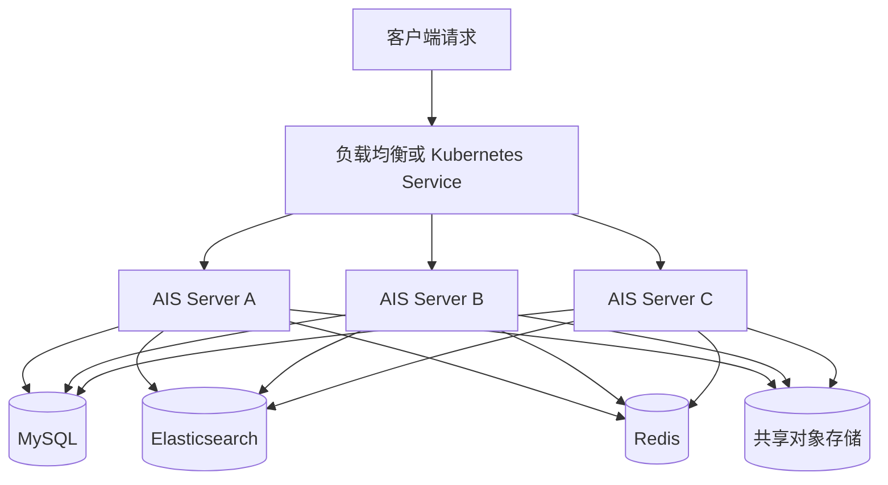

> 本文基于 AIS 当前的私有化部署实践碰到的问题进行整理。


## 一、AIS 当前架构和中间件依赖

AIS Server 当前采用 Java 和 Spring Boot 开发，核心业务以模块化单体的方式运行。应用内部划分了知识库、检索、工作流、应用管理、开放接口和系统管理等业务模块，对外以一套核心服务进行部署。

在完整生产部署中，AIS 主要依赖 MySQL、Elasticsearch、Redis、RabbitMQ 和对象存储。各组件的职责如下：

| 类型         | 当前组件或实现      | 在 AIS 中的主要职责                    | 当前状态                          |
| ------------ | ------------------- | -------------------------------------- | --------------------------------- |
| 关系型数据库 | MySQL               | 业务数据、配置、任务和运行记录持久化   | 核心依赖                          |
| 检索引擎     | Elasticsearch       | 全文检索、向量检索和 RAG 检索          | 核心依赖                          |
| 缓存与协调   | Redis               | 缓存、实时状态和部分协调能力           | 核心依赖                          |
| 消息队列     | RabbitMQ            | Embedding、摘要、同步等内部异步任务    | 当前仍在使用，计划迁移到 DB + Job |
| 文件存储     | OSS、MinIO 或 Local | 原始文件、解析文件、图片及其他材料存储 | 按客户环境选择一种实现            |

其中，对象存储涉及的产品和接口较多：

| 对象存储类型         | 主要使用场景                                 |
| -------------------- | -------------------------------------------- |
| 阿里云 OSS           | 公有云部署或客户已有阿里云环境               |
| 腾讯云 COS           | 客户已有腾讯云对象存储                       |
| 华为云 OBS           | 客户已有华为云对象存储                       |
| 联通云 OSS           | 联通云及相关项目环境                         |
| AWS S3 / S3 兼容存储 | 客户提供 S3 接口的对象存储                   |
| MinIO                | 常见的私有化对象存储方案                     |
| Local                | 本地磁盘存储，主要用于开发、POC 和轻量级部署 |

全局文件存储、ETL OSS 算子和 OSS 数据源同步属于不同功能入口，各入口当前支持的存储类型存在差异。实际交付时需要根据使用功能确认支持范围和配置方式。

这份中间件清单是 AIS 当前完整部署的基础。后续适配工作主要围绕两个问题展开：

- **对象存储需要覆盖不同厂商和不同资源规模**
- **简化AIS所引入的三方中间件的部署交付/适配成本**

## 二、交付过程中遇到的适配问题

### 2.1 客户已有基础设施不同

AIS知识库在私有化部署时，通常需要进入客户现有的数据中心或云平台。客户可能已经统一采购了数据库、Redis、Elasticsearch 和对象存储等相关的技术中间件，也可能只允许使用内部技术目录中的产品及版本。

对象存储的差异尤其明显。有的客户使用阿里云 OSS、腾讯云 COS 或华为云 OBS，有的客户提供 S3 兼容接口，有的客户则需要进行新建基础设施。AIS 需要通过配置和适配层接入这些环境，不能要求客户为了部署 AIS 再建设一套相同功能的平台。

### 2.2 POC 和小型项目资源有限

**标准生产环境会考虑多节点、高可用、备份和容灾。POC、演示和小型项目通常只有一台或少量服务器，主要目标是先完成业务验证**。

如果这些场景仍然按照完整生产规格部署 MySQL、Elasticsearch、Redis、RabbitMQ 和四节点 MinIO，服务器数量、安装时间和运维工作都会超出当前项目阶段的需要。

### 2.3 信创和安全管理要求

银行、国企和信创项目会对整套基础设施的产品来源、版本、漏洞、安全基线和运维方式进行审核，涉及 MySQL、Redis、Elasticsearch、RabbitMQ 和对象存储等全部中间件。客户可能要求使用内部技术目录中的指定产品，也可能要求替换为对应的国产化产品。

不同类型中间件需要验证的适配内容也不同：

| 中间件类型               | 主要适配和验证内容                                           |
| ------------------------ | ------------------------------------------------------------ |
| 关系型数据库             | JDBC 驱动、SQL 语法、字段类型、事务、锁、索引、DDL 和备份恢复 |
| Redis 及兼容产品         | 协议和命令兼容、集群模式、客户端、Lua 脚本、分布式锁和故障切换 |
| Elasticsearch 及兼容产品 | 客户端 API、索引 Mapping、分词器、向量字段、查询语法和索引迁移 |
| 消息队列                 | 生产消费接口、ACK、重试、死信、并发、顺序语义和监控方式      |
| 对象存储                 | SDK 或 API、鉴权、Bucket、对象路径、签名 URL 和文件迁移      |

每增加一种中间件，都需要补充以下工作：

- 产品和版本兼容性确认；
- 安装包及软件来源审核；
- 账号、权限、端口和网络策略配置；
- 安全扫描和漏洞修复；
- 监控、告警、备份和故障处理；
- 部署文档及运维交接。

中间件适配因此是一项覆盖开发、测试、部署和运维的持续工作。AIS 会根据交付频率、客户要求和改造收益分阶段推进。

## 三、当前优先推进的两项交付适配

结合目前遇到的项目情况，AIS 先从对象存储和 RabbitMQ 两个方面进行调整：

1. 客户使用的对象存储产品不同，POC 和小型项目的服务器资源也比较有限。AIS 扩展对象存储适配并增加 Local 模式，使项目可以接入客户已有存储，或者在轻量级部署中直接使用本地磁盘；
2. RabbitMQ 当前主要承担 AIS 内部异步任务。AIS 通过 DB + Job 建设内部可靠任务能力，在满足现有任务语义后逐步清退 RabbitMQ，减少一类需要安装、运维和信创适配的中间件。

这两项工作是 AIS 针对当前部署交付压力优先建设的能力。MySQL、Redis、Elasticsearch 等核心中间件的兼容和信创适配仍会根据客户环境继续推进。

### 3.1 对象存储适配与 Local 模式

#### 3.1.1 交付背景

AIS 中的原始文件、解析文件、图片和其他材料都需要文件存储。不同客户使用的对象存储产品和接口不同，因此 AIS 在存储层持续增加了阿里云 OSS、腾讯云 COS、华为云 OBS、联通云 OSS、AWS S3 / S3 兼容存储和 MinIO 等适配。

客户已经建设对象存储平台时，AIS 通过配置接入现有平台。客户没有对象存储平台时，私有化项目通常部署 MinIO。

MinIO 通常有两种部署方式：

- 单机模式：部署简单，适合规模较小、可以接受单点风险的环境；
- 分布式模式：AIS 当前生产部署方案采用四节点纠删码拓扑，用于提高可用性和故障容忍能力。

分布式 MinIO 会增加服务器、磁盘、网络和运维投入。对于正式生产环境，这些投入通常是必要的；对于 POC、演示和小型项目，单独准备对象存储服务有时会超出项目实际需要。

Local 模式就是针对后一类场景增加的部署选项。

#### 3.1.2 Local 模式的实现

AIS 现在支持 `LOCAL` 存储类型。启用后，文件直接写入 AIS Server 所在服务器的持久化目录：

```bash
TORCHV_OSS_TYPE=LOCAL
OSS_LOCAL_BASE_PATH=/data/ais/oss
OSS_LOCAL_DOMAIN=https://ais.example.com/oss_file/
```

上传后的文件由统一的 `/oss_file/**` 接口提供访问。业务代码仍然使用现有的存储接口，不需要根据 MinIO 或 Local 分别编写上传、下载逻辑。



Local 模式主要用于以下场景：

- 开发环境；
- 产品演示；
- POC 项目；
- 单台服务器部署；
- 对高可用要求不高的小型私有化项目。

它带来的直接变化是，以上场景可以不再单独部署 MinIO 或其他 OSS 服务，从而减少一项安装、配置和运维工作。

#### 3.1.3 三种交付方案

增加 Local 模式后，AIS 可以根据项目规模选择不同的文件存储方案：

| 场景               | 存储方案                    | 说明                                           |
| ------------------ | --------------------------- | ---------------------------------------------- |
| 开发、演示、POC    | Local 本地磁盘              | 资源要求最低，不单独部署对象存储服务           |
| 小型单机生产       | Local 或 MinIO 单机         | 根据文件管理和运维要求选择，需要配置独立备份   |
| 标准生产和集群部署 | 分布式 MinIO 或客户已有 OSS | 支持多实例访问，并按照生产要求建设高可用和容灾 |

Local 模式有明确的使用限制：

- 文件必须写入持久化磁盘，不能保存在容器可写层；
- 多个 AIS 实例不能分别使用各自的本地目录；
- 多实例使用 Local 时，需要共享 NAS、NFS 或支持多节点读写的共享卷；
- 需要监控磁盘容量、inode 和目录权限；
- 需要通过文件系统快照、NAS 快照、`rsync` 等方式建立独立备份；
- 需要临时签名、生命周期管理或跨区域容灾时，应使用专业对象存储。

MinIO 集群提供的纠删码和冗余也不能代替备份。节点故障容忍解决在线服务可用性，误删除、逻辑损坏和机房级事故仍然需要独立备份及恢复演练。

这次调整没有改变 AIS 上层的文件处理逻辑，主要变化发生在存储适配层和部署方案中。

### 3.2 RabbitMQ 向 DB + Job 迁移


#### 3.2.1 交付背景

AIS 当前仍然使用 RabbitMQ，覆盖 Embedding、摘要、文件路径更新、知识地图同步、第三方同步等任务。

在交付过程中，RabbitMQ 需要单独完成以下工作：

- 安装和版本确认；
- 账号、权限、端口和网络配置；
- 安全扫描和漏洞处理；
- 队列、连接、Channel 和积压监控；
- 高可用、备份和故障处理；
- 信创环境下的兼容性确认或替代组件适配。

这些工作对于通用消息平台是合理的，但 AIS 当前大部分 RabbitMQ 使用场景都发生在系统内部，消息由 AIS 产生，也由 AIS 自己消费，**主要目的是把耗时任务放到后台可靠执行**。

基于这一使用特点，AIS 计划使用 MySQL 持久化任务、周期 Job 和本地 Worker 替代 RabbitMQ。改造完成后，私有化部署可以少维护一类中间件，也可以减少针对不同消息队列产品的适配工作。

#### 3.2.2 DB 持久化任务的运行方式

目标方案在 MySQL 中增加统一任务表。业务 Service 在写入业务数据时，同时提交一条异步任务记录。任务提交成功后，由各个 AIS 节点上的 Worker 领取并执行。



任务平台主要包含以下能力：

- 任务提交和去重；
- 多节点原子领取；
- 有界线程池和背压；
- 执行租约和续租；
- 失败重试；
- 死信状态；
- 节点故障后的任务恢复；
- 执行尝试记录；
- 历史任务清理；
- 指标和管理操作。

MySQL 是任务状态的事实来源。Redis 可以作为可选的 Worker 唤醒信号，但任务可靠性不依赖 Redis。任务执行采用至少一次语义，因此各业务 Processor 需要保证幂等。

业务数据和异步任务可以在同一个数据库事务中提交。例如，业务数据回滚时，不会留下已经进入队列但找不到业务数据的任务；任务记录提交成功后，即使应用节点随后退出，其他节点仍然可以继续领取。

#### 3.2.3 Job、Worker 和 MySQL 的职责

在目标方案中，三个部分的职责分别是：

| 部分   | 职责                                     |
| ------ | ---------------------------------------- |
| MySQL  | 保存任务状态、租约、重试次数和执行记录   |
| Worker | 根据本地线程池容量领取并执行业务任务     |
| Job    | 定期执行租约恢复、历史清理和其他维护工作 |

各个 Worker 直接从数据库竞争领取任务，不增加中心调度服务。节点退出后，未完成任务通过租约超时恢复，不需要把任务固定迁移给某个指定节点。

这套设计同时支持单节点和多节点部署。单节点环境只运行一个 Worker；多节点环境中的 Worker 使用相同任务模型并发领取任务。

#### 3.2.4 迁移方式

RabbitMQ 当前仍在使用，因此迁移按任务类型逐步进行：

```text
RABBIT_ONLY -> DB_SHADOW -> DB_ONLY -> 排空旧队列 -> 删除 RabbitMQ
```

- `RABBIT_ONLY`：继续由 RabbitMQ 执行业务；
- `DB_SHADOW`：校验任务定义、Payload、序列化和幂等键，不创建可领取任务；
- `DB_ONLY`：只创建和执行 DB 持久化任务。

每个 Listener 迁移时，先提取独立且幂等的业务 Processor，再分别由 Rabbit Listener 和新的 Durable Task Handler 调用。验证 DB 模式后切换生产入口，最后排空旧队列并删除对应 Listener、Producer 和队列配置。

同一个业务请求不能由 RabbitMQ 和 DB 同时执行，避免迁移期间重复处理。

#### 3.2.5 调整后的成本

RabbitMQ 提供的可靠性能力在移除后需要由任务平台承接。DB + Job 方案会增加以下工作：

- MySQL 任务表和执行记录表的容量管理；
- 任务领取 SQL 和索引优化；
- 空轮询、批量大小和 Worker 并发控制；
- 任务积压、重试、死信和执行延迟监控；
- 历史任务清理；
- 多节点竞争、节点退出和数据库短时不可用测试；
- 业务 Processor 幂等改造。

这项改造的收益来自整体交付和运维成本的下降，而不是任务平台代码量的减少。

当前方案只针对 AIS 内部可靠异步任务。跨系统事件分发、超高吞吐事件流、长时间消息回放和严格分区顺序等场景，仍然需要根据业务要求评估专业消息平台。

## 四、模块化单体与私有化交付

OSS 和 RabbitMQ 的两项调整都建立在 AIS 当前的模块化单体架构上。

AIS 没有把知识库、应用、检索、任务和系统管理拆成多套独立微服务。核心业务运行在同一个 Spring Boot 服务中，内部通过包结构和分层区分业务域：

- `application` 和 `kb` 承载业务能力；
- `repository` 统一负责数据访问；
- `infra` 封装 OSS、检索、Embedding、事件等基础设施；
- `system` 提供安全、配置和任务等系统能力。

### 4.1 单体服务与多节点部署

单体描述的是代码组织和发布单元，不限制运行实例的数量。AIS 使用同一套应用制品即可部署多个节点，由负载均衡或 Kubernetes Service 将请求分发到不同实例。



MySQL、Elasticsearch、Redis 和对象存储由各个 AIS 实例共享，业务请求不依赖某一台固定的应用服务器。请求量增加时，可以增加 AIS Server 实例扩展应用层的并发处理能力。DB 持久化任务改造完成后，各节点上的 Worker 也会根据本地线程池容量竞争领取任务，异步任务处理能力可以随应用节点一起扩展。

这种部署方式保留了单体服务在开发、发布和事务管理上的简单性，同时支持生产环境中的多节点运行。单机环境与集群环境使用相同的代码和业务模型，主要差异集中在实例数量、基础设施配置和高可用方案。

### 4.2 多节点运行中的事务和数据一致性

多节点部署要求共享状态不能只保存在某个应用进程中。AIS 在业务实现中按照数据职责处理一致性：

- 业务数据以 MySQL 为事实来源，关联数据更新在明确的数据库事务中完成；
- DB 持久化任务与业务数据可以在同一事务中提交，事务回滚时不会留下孤立任务；
- 多节点任务领取通过数据库原子更新、租约和状态机控制，避免将任务固定绑定到某个节点；
- 需要防止重复提交的业务使用唯一约束、幂等键或业务状态校验；
- 持久化任务采用至少一次语义，业务 Processor 需要具备幂等处理能力；
- Elasticsearch 保存面向检索的数据，业务判断仍以 MySQL 中的事实状态为准；
- 多节点文件访问必须使用共享对象存储或共享卷，不能让各实例使用彼此独立的本地目录。

应用节点可以横向扩展，但整体容量仍然受 MySQL、Elasticsearch、Redis、对象存储、外部模型服务和网络资源影响。增加 AIS 节点主要扩展应用层请求及任务执行能力，生产部署仍需根据监控数据评估数据库连接、索引负载、线程池和外部服务容量。

### 4.3 对私有化交付的影响

在私有化交付中，这种结构有几个实际影响：

1. **交付制品较少**
   核心服务使用一套主要制品和配置，部署、升级及回滚步骤较集中。

2. **不额外引入微服务治理组件**
   当前不需要为服务拆分部署注册中心、配置中心和服务间治理体系。

3. **业务事务更容易控制**
   DB 持久化任务可以和业务数据在同一事务中提交，不需要处理跨服务事务。

4. **便于进入客户现有 Java 环境**
   银行、国企通常已经具备 Java 应用的开发、部署、监控和安全管理基础。AIS 仍需要根据客户要求完成 JDK、数据库和中间件兼容验证，但整体技术栈与现有体系的衔接成本相对可控。

5. **基础设施调整集中在适配层**
   OSS 增加 Local 实现，以及 RabbitMQ 向持久化任务迁移，主要修改基础设施和任务平台，上层知识库业务不需要跟随部署方式重复改造。

6. **应用层支持横向扩展**
   单机部署可以降低 POC 和小型项目的资源要求；生产环境可以使用同一应用制品扩展多个 AIS Server 节点，通过负载均衡提升应用层处理能力。

模块化单体仍然控制内部边界，避免业务逻辑代码和基础设施代码相互穿透。以后如果某个业务域出现独立扩缩容、独立发布或故障隔离要求，再根据实际需要拆分服务。

## 五、从两项交付调整形成的架构思考

OSS 和 RabbitMQ 的调整针对的是不同问题，但处理方式比较一致。

### 5.1 按交付规模提供部署组合

AIS 的部署方案需要覆盖 POC、单机生产和集群生产，不同场景不应强制使用相同的基础设施规模。

| 交付类型   | 文件存储                    | 异步任务目标形态 | 主要考虑                   |
| ---------- | --------------------------- | ---------------- | -------------------------- |
| 开发或 POC | Local                       | 单节点 DB Worker | 减少服务器和安装工作       |
| 小型生产   | Local 或 MinIO 单机         | 单节点 DB Worker | 配置持久化、监控和独立备份 |
| 标准生产   | 分布式 MinIO 或客户已有 OSS | 多节点 DB Worker | 高可用、容量和故障恢复     |

### 5.2 优先复用客户已有基础设施

客户已经建设对象存储、数据库或缓存平台时，AIS 优先通过配置和适配接入，不再重复建设一套同类组件。

信创环境可以先减少必须适配的组件种类，再对保留的核心组件进行兼容验证，避免同时维护多套中间件替代实现。

### 5.3 把部署差异放在基础设施层

Local 与 MinIO 的选择由存储适配层处理；RabbitMQ 与 DB 持久化任务的迁移通过统一任务发布接口处理。业务 Service 只表达“保存文件”或“提交异步任务”，不直接依赖具体部署组件。

这种边界可以减少客户定制对业务代码的影响，也方便后续继续增加新的存储或任务实现。

### 5.4 保留必要的中间件

减少中间件依赖不代表所有能力都要由 AIS 自己实现。

MySQL、Elasticsearch 和 Redis 目前分别承担业务事实、检索和缓存协调能力，这些能力与 AIS 的核心业务直接相关。RabbitMQ 和独立 OSS 服务之所以可以调整，是因为现有使用场景能够由内部任务平台或 Local 存储覆盖。

每个组件是否保留，需要同时评估功能语义、可靠性、性能和交付成本。

## 六、总结

AIS 最近的两项基础设施调整都来自实际交付问题：

- 增加 Local 文件存储，使开发、POC 和小型项目可以不单独部署 OSS 服务；
- 设计 DB + Job 持久化任务，逐步替代 RabbitMQ，减少一类中间件的部署和信创适配工作。

这两项调整没有改变 AIS 的核心业务形态。AIS Server 继续采用 Java 模块化单体，MySQL、Elasticsearch 和 Redis 保持各自职责，存储和异步任务的差异由基础设施层处理。

后续架构演进仍会以交付反馈为依据：客户已有的能力优先复用，资源有限的场景提供简化部署，正式生产环境补齐高可用、备份、监控和恢复验证。

架构设计最终需要落实到具体的服务器数量、安装步骤、兼容范围和故障处理方式。对 AIS 来说，交付过程中发现的问题已经成为架构调整的重要输入。
